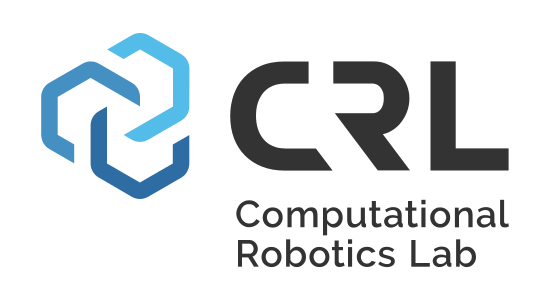
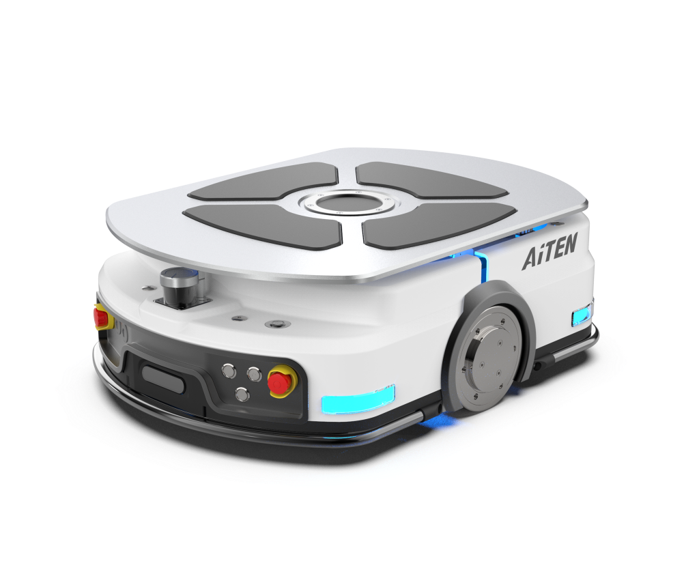
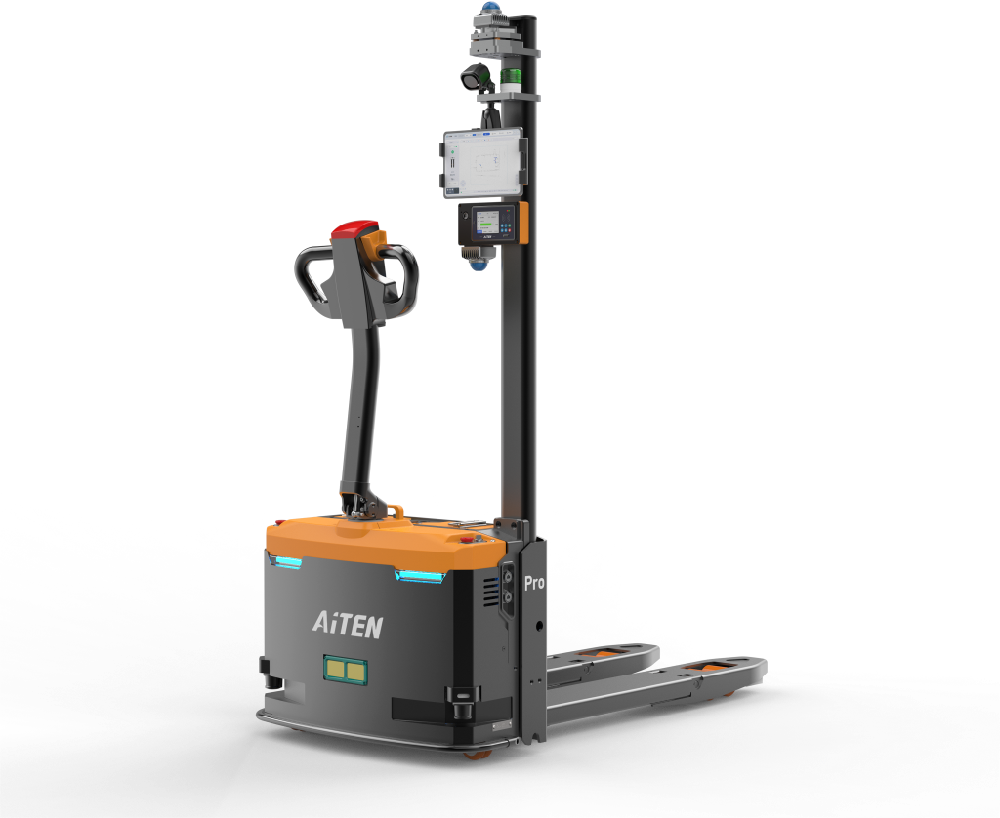
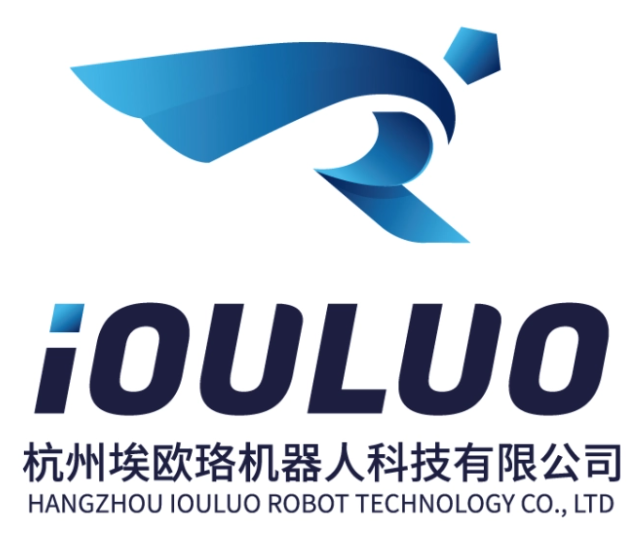
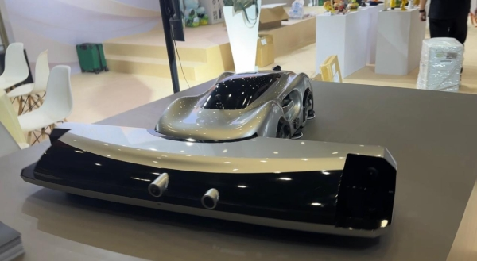
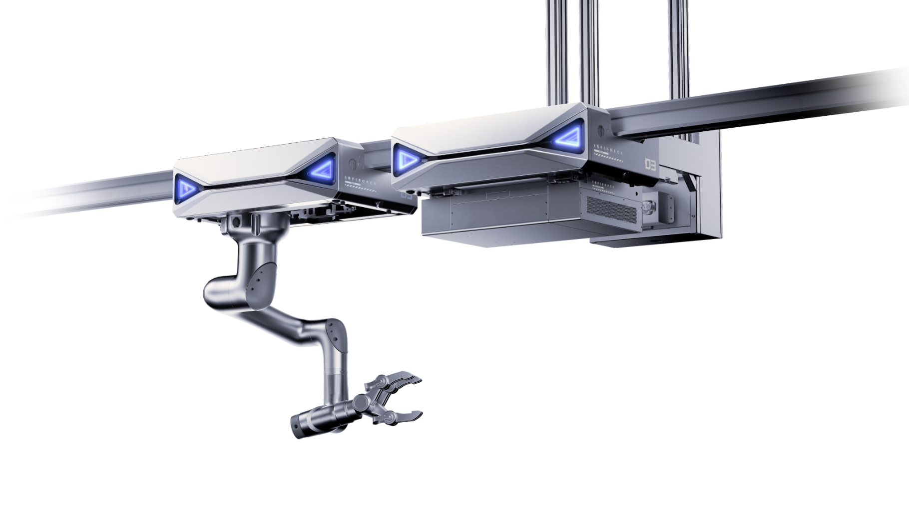
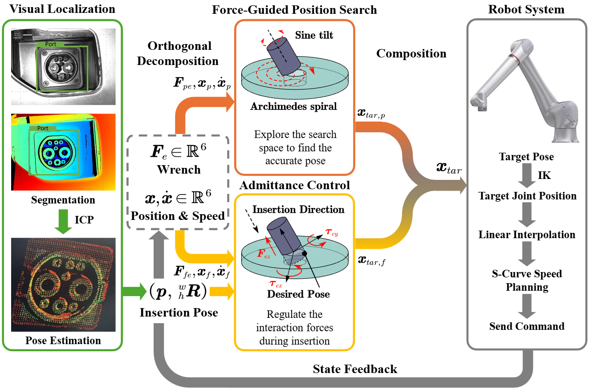
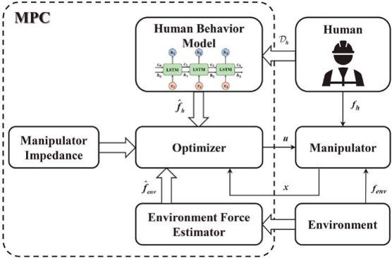
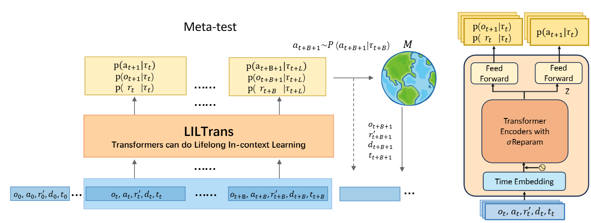
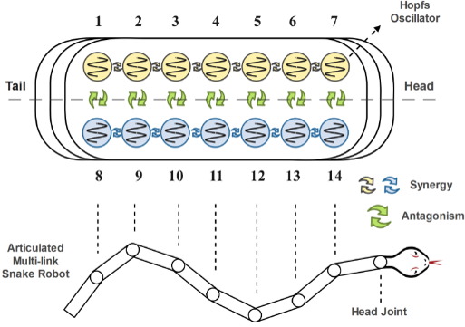








I am currently a Master's student in Control Science and Engineering at Zhejiang University, advised by [Prof. Qinyuan Ren](https://person.zju.edu.cn/en/0008668). I am passionate about robotics, with a focus on making robots robust in dynamic, unstructured environments. My research combines control, planning, and reinforcement learning to enable autonomous systems that work reliably in the real world.

My work emphasizes cross-disciplinary collaboration, as seen in my internship at ETH Zurich's [Computational Robotics Lab](https://crl.ethz.ch/index.html)(CRL) with [Dr. Yijiang Huang](https://yijiangh.github.io/). I thrive in environments that mix mechanical design, control, and AI, and I'm passionate about mentoring juniors and fostering inclusive academic spaces. I'm applying to PhD programs to advance reliable robotic systems for dynamic, unstructured environments.

Feel free to contact me!

# 📚 Research Interests
My current research focuses on developing reliable robotic systems capable of operating in cluttered environments and adapting to changes in real-time. Specifically, I am interested in the intersection of:
- 🤖 **Robotics**: &nbsp; Autonomous manipulation, task-and-motion planning, mobile robots, legged robots
- 🏗️ **Control Systems**: &nbsp; Hybrid force-position control, human-robot interaction
- 🧠 **Machine Learning**: &nbsp; Reinforcement learning, imitation learning, data-driven control

I aim to advance the field by developing robots that can understand and adapt to dynamic environments, including human-robot interaction in assistive living, sports, and construction applications.

# 🎓 Education
- **Master's Degree in Control Science and Engineering**, [College of Control Science and Engineering](http://www.cse.zju.edu.cn/cseenglish/main.htm), [Zhejiang University](https://www.zju.edu.cn/english/), Hangzhou, China, Advisor: Prof. Qinyuan Ren. (Ongoing; Thesis: *Multi-modal Perception and Control Strategy for Unlocking Tasks Utilizing Manipulators*)
- **Bachelor's Degree in Mechatronics Engineering (Chu Kochen Honors Program)** and **Bachelor's Degree in Automation(Control)**, [School of Mechanical Engineering](http://me.zju.edu.cn/meenglish/main.psp), [Zhejiang University](https://www.zju.edu.cn/english/), Hangzhou, China.

# 🔎 Research Experience

    
    

        <h3 style="margin: 0;">Zeno AI</h3>
        
Embodied AI Researcher, <em>Nov. 2025 - Present</em>

        
Research Focus: Whole-body teleoperation and embodied AI

        
Advisor: <a href="https://www.weimingzhi.com/" target="_blank">Prof. William Zhi</a>

    

    
    

        <h3 style="margin: 0;"><a href="https://crl.ethz.ch/index.html" style="text-decoration: none; color: inherit;">CRL Lab</a>, ETH Zurich</h3>
        
Research Intern, <em>Jun. 2024 - Present</em>

        
Research Focus: task and motion planning (TAMP) strategies for autonomous scaffolding assembly utilizing mobile manipulators

        <!-- 
Advisor: <a href="https://crl.ethz.ch/people/coros/index.html" target="_blank">Prof. Dr. Stelian Coros</a>
 -->
        
Mentor: <a href="https://yijiangh.github.io/" target="_blank">Dr. Yijiang Huang</a>

    

    
    

        <h3 style="margin: 0;"><a href="https://github.com/ZJU-Biorobotics" style="text-decoration: none; color: inherit;">ZJU-Biorobotics</a>, Zhejiang University</h3>
        
Undergraduate Research Intern, <em>Mar. 2021 - May. 2022</em>

        
Research Focus: Mechanical design and locomotion control of bio-inspired snake-like robots

        
Advisor: <a href="https://person.zju.edu.cn/en/0008668" target="_blank">Prof. Qinyuan Ren</a>

    

<!-- 

    
    

        <h3 style="margin: 0;"><a href="https://www.robomaster.com/en-US" style="text-decoration: none; color: inherit;">ROBOMASTER</a>, Shenzhen Dajiang Innovation Technology Co., Ltd</h3>
        
Developer, <em>Sep. 2020 - Aug. 2021</em>

        
Focus: Electrical design and embedded algorithm development of engineering robots

        
Mentor: <a href="https://ieeexplore.ieee.org/author/37089021960" target="_blank">Dr. Pujing Lin</a>

    

 -->

    
    

        <h3 style="margin: 0;"><a href="https://www.researchgate.net/lab/Robotics-Machine-Intelligence-Lab-ZJU-Qiuguo-Zhu" style="text-decoration: none; color: inherit;">Robotics & Machine Intelligence Lab</a>, Zhejiang University</h3>
        
Undergraduate Research Intern, <em>Jul. 2020 - Aug. 2020</em>

        
Research Focus: Locomotion of legged robots

        
Advisor: <a href="https://person.zju.edu.cn/en/0011353" target="_blank">Prof. Qiuguo Zhu</a>

        
Mentor: <a href="https://wang-zhicheng.github.io/" target="_blank">Dr. Zhicheng Wang</a>

    

# 🏗 Industrial Partnerships

  Below is an overview of the R&amp;D work on industry-grade robotic products that I have led or participated in.

<!-- 

    

        <h3 style="margin: 1; font-size: 1.6em;">
            <a href="https://www.aitenrobot.com/" style="text-decoration: none; color: inherit;">
                AiTEN Robotics
            </a>
        </h3>
        
    

    

        

            
            
TT15

        

    

    

        
        
APe15

    

    

        <h3 style="margin: 1; font-size: 1.6em;">
            IOULUO Robot
        </h3>
        
    

    

        

            
        

    

    

        <h3 style="margin: 1; font-size: 1.6em;">
            ELU.AI
        </h3>
        
    

    

        

            
            
FORCE-02

        

    

 -->

<!-- AiTEN Robotics -->

    

        
    

    

        

            
            
TT15

        

        

            
            
APe15

        

    

<!-- IOULUO Robot -->

    

        
    

    

        

            
        

    

<!-- ELU.AI -->

    

        
    

    

        

            
            
FORCE-02

        

    

# 📝 Selected Publications

    
    

        <strong style="font-size: 1.4rem;">
            Vision-Force Guided Robotic EV Charging: Learning-Based Localization and 6-DoF Hybrid Compliance Control for High-Precision Insertion
        </strong>  
        
            <strong>Zihao Li</strong>, Siqi Wang, Xiaocong Li, Yiming Zhu, Zhe Zhong, Yilin Lang, Qinyuan Ren
          
        <em style="font-size: 1.15rem;">
            IEEE 19th International Conference on Control & Automation (ICCA), 2025
        </em>
    

    
    

        <strong style="font-size: 1.4rem;">
            A Motion Control Approach for Physical Human–Robot-Environment Interaction via Operational Behaviors Inference
        </strong>  
        
            Yilin Lang, <strong>Zihao Li</strong>, Zhaoyang Li, Yanan Li, Qinyuan Ren
          
        <em style="font-size: 1.15rem;">
            IEEE Transactions on Industrial Electronics, 2024
        </em>
    

    
    

        <strong style="font-size: 1.4rem;">
            Meta-reinforcement Learning Robust to Distributional Shift via Performing Lifelong In-context Learning
        </strong>  
        
            Tengye Xu, <strong>Zihao Li</strong>, Zihao Li, Qinyuan Ren
          
        <em style="font-size: 1.15rem;">
            Forty-first International Conference on Machine Learning, 2024
        </em>
    

    
    

        <strong style="font-size: 1.4rem;">
            A Head Stabilizer of A Snake Robot Crawling in Serpentine Locomotion
        </strong>  
        
            <strong>Zihao Li</strong>, Jiangpeng Hu, Qinyuan Ren
          
        <em style="font-size: 1.15rem;">
            IEEE 17th Conference on Industrial Electronics and Applications (ICIEA), 2022
        </em>
    

**For more details, please visit: [Zihao Li](https://scholar.google.com/citations?view_op=list_works&hl=zh-CN&hl=zh-CN&user=KNMrDtcAAAAJ&sortby=pubdate)**

# 🏆 Honors and Awards
- The 2nd winner of the International Design Contest (IDC RoboCon), *Aug. 2022*
- Arawana's Scholarship of Yihai Kerry Arawana Holdings Co., Ltd, *2022*
- Frist prize of China Univeristy Robot Competition (ROBOMASTER), *Aug. 2021*
- Hong Huang and Xiaobei Wu's Scholarship, *2021*
- Frist prize of Chinese Mathematics Competition (CMC) in Zhejiang Province, *Dec. 2020*
- Frist prize of Zhejiang Physics Innovation Competition, *Dec. 2020*
- Zhejiang Provincial Government Scholarship, *2020*
- Zhejiang University Scholarship - Second Prize, *2020*
- Zhejiang University Academic Excellence Award, *2019 - 2020*
- Zhejiang University Artistic and Athletic Achievement Award, *2019 - 2020*

# 🎽 Specialties and Hobbies
- I love basketball🏀, badminton🏸, swimming🏊‍ and so much more.
- I enjoy video games like Hollow Knight and God of War.
