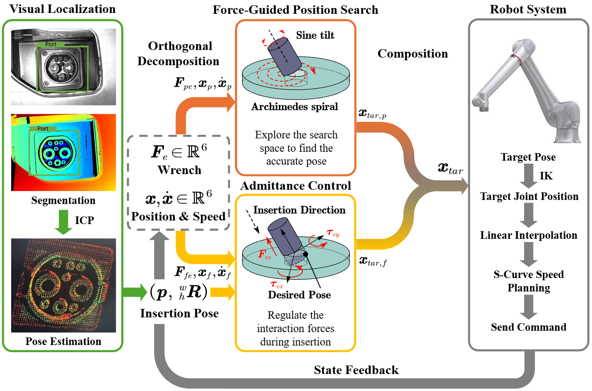
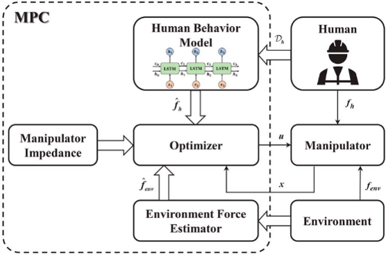
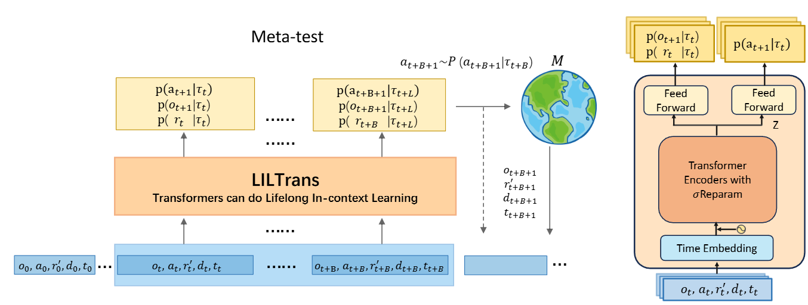
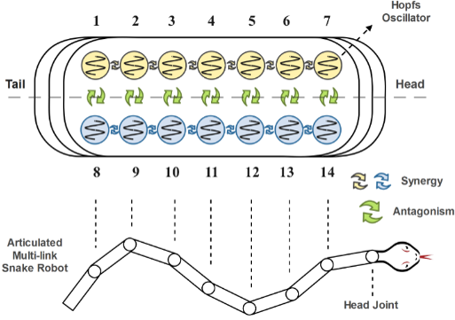








I am currently a PhD student in Computer Science at [The University of Sydney](https://www.sydney.edu.au/), advised by [Prof. Weiming (William) Zhi](https://www.weimingzhi.com/). I am passionate about robot manipulation and embodied intelligence, with a focus on enabling robots to perceive, reason, and act in complex real-world environments. My research explores Vision-Language-Action (VLA) models, multimodal learning, imitation learning, and reinforcement learning to develop generalizable robot policies.

My work emphasizes cross-disciplinary collaboration, including my internship at ETH Zurich's [Computational Robotics Lab](https://crl.ethz.ch/index.html) (CRL) with [Dr. Yijiang Huang](https://yijiangh.github.io/). I thrive in environments that mix mechanical design, control, and AI, and I'm passionate about mentoring juniors and fostering inclusive academic spaces. Through my PhD, I aim to develop generalizable and adaptive embodied agents for real-world manipulation.

Feel free to contact me!

# 📚 Research Interests
My current research focuses on robot manipulation and embodied intelligence, with an emphasis on learning generalizable robot policies from multimodal data. Specifically, I am interested in:
- 🤖 **Robot Manipulation**: &nbsp; Dexterous and mobile manipulation, long-horizon tasks, task-and-motion planning
- 🧠 **Embodied Intelligence**: &nbsp; Visuomotor policy learning, imitation and reinforcement learning, generalization and adaptation
- 🌐 **Vision-Language-Action Models**: &nbsp; Multimodal representation learning, language-conditioned control, foundation models for robotics

I aim to build embodied agents that can understand multimodal instructions, reason about their environments, and perform complex manipulation tasks robustly in the real world.

# 🎓 Education
- **PhD in Computer Science**, [School of Computer Science](https://www.sydney.edu.au/engineering/schools/school-of-computer-science.html), [The University of Sydney](https://www.sydney.edu.au/), Sydney, Australia, Advisor: [Prof. Weiming (William) Zhi](https://www.weimingzhi.com/). (*Jul. 2026 - Present*)
- **Master's Degree in Control Science and Engineering**, [College of Control Science and Engineering](http://www.cse.zju.edu.cn/cseenglish/main.htm), [Zhejiang University](https://www.zju.edu.cn/english/), Hangzhou, China, Advisor: Prof. Qinyuan Ren. (Completed; Thesis: *Multi-modal Perception and Control Strategy for Unlocking Tasks Utilizing Manipulators*)
- **Bachelor's Degree in Mechatronics Engineering (Chu Kochen Honors Program)** and **Bachelor's Degree in Automation (Control)**, [School of Mechanical Engineering](http://me.zju.edu.cn/meenglish/main.psp), [Zhejiang University](https://www.zju.edu.cn/english/), Hangzhou, China.

# 🔎 Research Experience

    
    

        <h3 style="margin: 0;">Zeno AI</h3>
        
Embodied AI Researcher, <em>Nov. 2025 - Present</em>

        
Research Focus: Whole-body teleoperation and embodied AI

    

    
    

        <h3 style="margin: 0;"><a href="https://crl.ethz.ch/index.html" style="text-decoration: none; color: inherit;">CRL Lab</a>, ETH Zurich</h3>
        
Research Intern, <em>Jun. 2024 - Feb. 2026</em>

        
Research Focus: task and motion planning (TAMP) strategies for autonomous scaffolding assembly utilizing mobile manipulators

        <!-- 
Advisor: <a href="https://crl.ethz.ch/people/coros/index.html" target="_blank">Prof. Dr. Stelian Coros</a>
 -->
        
Mentor: <a href="https://yijiangh.github.io/" target="_blank">Dr. Yijiang Huang</a>

    

    
    

        <h3 style="margin: 0;"><a href="https://github.com/ZJU-Biorobotics" style="text-decoration: none; color: inherit;">ZJU-Biorobotics</a>, Zhejiang University</h3>
        
Undergraduate Research Intern, <em>Mar. 2021 - May. 2022</em>

        
Research Focus: Mechanical design and locomotion control of bio-inspired snake-like robots

        
Advisor: <a href="https://person.zju.edu.cn/en/0008668" target="_blank">Prof. Qinyuan Ren</a>

    

    
    

        <h3 style="margin: 0;"><a href="https://www.robomaster.com/en-US" style="text-decoration: none; color: inherit;">ROBOMASTER</a>, Shenzhen Dajiang Innovation Technology Co., Ltd</h3>
        
Developer, <em>Sep. 2020 - Aug. 2021</em>

        
Focus: Electrical design and embedded algorithm development of engineering robots

        
Mentor: <a href="https://ieeexplore.ieee.org/author/37089021960" target="_blank">Dr. Pujing Lin</a>

    

    
    

        <h3 style="margin: 0;"><a href="https://www.researchgate.net/lab/Robotics-Machine-Intelligence-Lab-ZJU-Qiuguo-Zhu" style="text-decoration: none; color: inherit;">Robotics & Machine Intelligence Lab</a>, Zhejiang University</h3>
        
Undergraduate Research Intern, <em>Jul. 2020 - Aug. 2020</em>

        
Research Focus: Locomotion of legged robots

        
Advisor: <a href="https://person.zju.edu.cn/en/0011353" target="_blank">Prof. Qiuguo Zhu</a>

        
Mentor: <a href="https://wang-zhicheng.github.io/" target="_blank">Dr. Zhicheng Wang</a>

    

# 🛠️ Professional Experience

  Below is an overview of the R&amp;D work on industry-grade robotic products that I have led or participated in.

<!-- 

    

        
    

    

        

            
            
TT15

        

        

            
            
APe15

        

    

    

        
    

    

        

            
        

    

    

        
    

    

        

            
            
FORCE-02

        

    

 -->

<!-- AiTEN Robotics -->

    <!-- 公司列（固定宽度） -->
    

        
        

            <strong>Position:</strong> Electrical Engineer 
            <strong>Main work:</strong> Designing circuit boards, developing embedded programs, and building Python backends
        

    

    <!-- 产品列（固定宽度） -->
    

        

            
            
TT15

        

        

            
            
APe15

        

    

    <!-- 描述列（文本单独一栏，对齐） -->
    

        

            Autonomous navigation and flexible operation; equipped with SLAM laser technology for intelligent path planning; efficient operation in warehouses and other complex industrial environments; optimizes production efficiency and reduces labor costs.
        

        <!-- 

            Main responsibilities: [Your main responsibilities on APe15]
        
 -->
    

<!-- IOULUO Robot -->

    <!-- 公司列（固定宽度） -->
    

        
        

            <strong>Position:</strong> Intern 
            <strong>Main work:</strong> Developing control algorthms
        

    

    <!-- 产品列（固定宽度） -->
    

        

            
        

    

    <!-- 描述列 -->
    

        

            Cleaning of glass curtain walls and photovoltaic surfaces; autonomous perception with intelligent path planning and automatic obstacle avoidance.
        

        <!-- 

            Main responsibilities: [Your main responsibilities on IOULUO robot project]
        
 -->
    

<!-- ELU.AI -->

    <!-- 公司列（固定宽度） -->
    

        
        

            <strong>Position:</strong> Project leader 
            <strong>Main work:</strong> Leading the development and designing control algorithms
        

    

    <!-- 产品列（固定宽度） -->
    

        

            
            
FORCE-02

        

    

    <!-- 描述列 -->
    

        

            Fully automated charging process; unmanned, high-efficiency scheduling system; autonomously adapts to complex charging environments to maximize charging efficiency and resource utilization.
        

        <!-- 

            Main responsibilities: [Your main responsibilities on FORCE-02]
        
 -->
    

# 📝 Selected Publications

    <strong style="font-size: 1.4rem;">
        <a href="https://doi.org/10.1007/s41693-026-00191-3" target="_blank" style="text-decoration: none; color: inherit;">A robot-friendly scaffolding system with passive error correction using tapered screw connectors</a>
    </strong>  
    Pok Yin Victor Leung, Yijiang Huang, Yen-Ting Liu, Jakob Genhart, <strong>Zihao Li</strong>, Caelan Garrett, Stelian Coros  
    <em style="font-size: 1.15rem;">Construction Robotics, 2026</em>

    <strong style="font-size: 1.4rem;">
        <a href="https://arxiv.org/abs/2606.16490" target="_blank" style="text-decoration: none; color: inherit;">Robots that Collaborate: Sequential Asymmetric Imitation for Learning Coupled Robot Policies</a>
    </strong>  
    Yincong Chen, Ranpeng Qiu, <strong>Zihao Li</strong>, Yanan Zhou, Guoqiang Ren, Weiming Zhi  
    <em style="font-size: 1.15rem;">arXiv preprint arXiv:2606.16490, 2026</em>

    <strong style="font-size: 1.4rem;">
        <a href="https://arxiv.org/abs/2606.14551" target="_blank" style="text-decoration: none; color: inherit;">TRACE: Trajectory-Routed Causal Memory for Delayed-Evidence Visuomotor Imitation</a>
    </strong>  
    <strong>Zihao Li</strong>, Ranpeng Qiu, Yincong Chen, Guoqiang Ren, Weiming Zhi  
    <em style="font-size: 1.15rem;">arXiv preprint arXiv:2606.14551, 2026</em>

    <strong style="font-size: 1.4rem;">
        <a href="https://arxiv.org/abs/2602.09888" target="_blank" style="text-decoration: none; color: inherit;">TriPilot-FF: Coordinated Whole-Body Teleoperation with Force Feedback</a>
    </strong>  
    <strong>Zihao Li</strong>, Yanan Zhou, Ranpeng Qiu, Hangyu Wu, Guoqiang Ren, Weiming Zhi  
    <em style="font-size: 1.15rem;">arXiv preprint arXiv:2602.09888, 2026</em>

    <strong style="font-size: 1.4rem;">
        <a href="https://arxiv.org/abs/2511.05052" target="_blank" style="text-decoration: none; color: inherit;">TAPOM: Task-Space Topology-Guided Motion Planning for Manipulating Elongated Object in Cluttered Environments</a>
    </strong>  
    <strong>Zihao Li</strong>, Yiming Zhu, Zhe Zhong, Qinyuan Ren, Yijiang Huang  
    <em style="font-size: 1.15rem;">arXiv preprint arXiv:2511.05052, 2025</em>

    
    

        <strong style="font-size: 1.4rem;">
            Vision-Force Guided Robotic EV Charging: Learning-Based Localization and 6-DoF Hybrid Compliance Control for High-Precision Insertion
        </strong>  
        
            <strong>Zihao Li</strong>, Siqi Wang, Xiaocong Li, Yiming Zhu, Zhe Zhong, Yilin Lang, Qinyuan Ren
          
        <em style="font-size: 1.15rem;">
            IEEE 19th International Conference on Control & Automation (ICCA), 2025
        </em>
    

    
    

        <strong style="font-size: 1.4rem;">
            A Motion Control Approach for Physical Human–Robot-Environment Interaction via Operational Behaviors Inference
        </strong>  
        
            Yilin Lang, <strong>Zihao Li</strong>, Zhaoyang Li, Yanan Li, Qinyuan Ren
          
        <em style="font-size: 1.15rem;">
            IEEE Transactions on Industrial Electronics, 2024
        </em>
    

    
    

        <strong style="font-size: 1.4rem;">
            Meta-reinforcement Learning Robust to Distributional Shift via Performing Lifelong In-context Learning
        </strong>  
        
            Tengye Xu, <strong>Zihao Li</strong>, Zihao Li, Qinyuan Ren
          
        <em style="font-size: 1.15rem;">
            Forty-first International Conference on Machine Learning, 2024
        </em>
    

    
    

        <strong style="font-size: 1.4rem;">
            A Head Stabilizer of A Snake Robot Crawling in Serpentine Locomotion
        </strong>  
        
            <strong>Zihao Li</strong>, Jiangpeng Hu, Qinyuan Ren
          
        <em style="font-size: 1.15rem;">
            IEEE 17th Conference on Industrial Electronics and Applications (ICIEA), 2022
        </em>
    

**For more details, please visit: [Zihao Li](https://scholar.google.com/citations?user=KNMrDtcAAAAJ)**

# 🏆 Honors and Awards
- The 2nd winner of the International Design Contest (IDC RoboCon), *Aug. 2022*
- Arawana's Scholarship of Yihai Kerry Arawana Holdings Co., Ltd, *2022*
- Frist prize of China Univeristy Robot Competition (ROBOMASTER), *Aug. 2021*
- Hong Huang and Xiaobei Wu's Scholarship, *2021*
- Frist prize of Chinese Mathematics Competition (CMC) in Zhejiang Province, *Dec. 2020*
- Frist prize of Zhejiang Physics Innovation Competition, *Dec. 2020*
- Zhejiang Provincial Government Scholarship, *2020*
- Zhejiang University Scholarship - Second Prize, *2020*
- Zhejiang University Academic Excellence Award, *2019 - 2020*
- Zhejiang University Artistic and Athletic Achievement Award, *2019 - 2020*

# 🎽 Specialties and Hobbies
- I love basketball🏀, badminton🏸, swimming🏊‍ and so much more.
- I enjoy video games like Hollow Knight and God of War.
