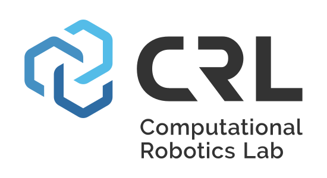
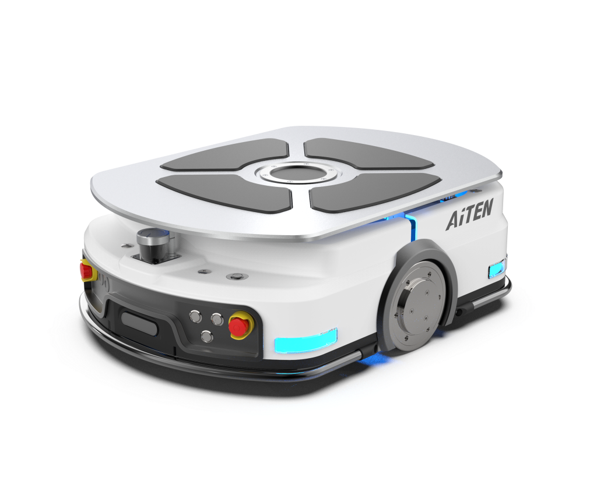
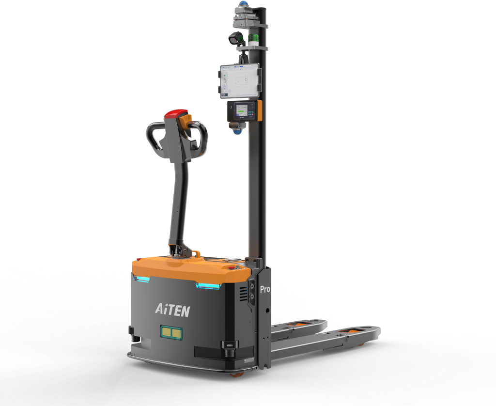
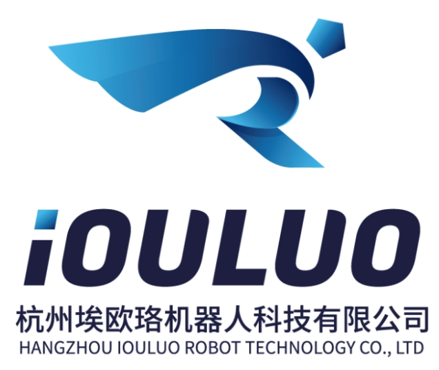
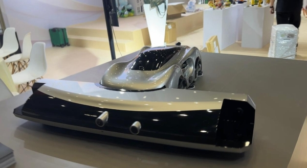
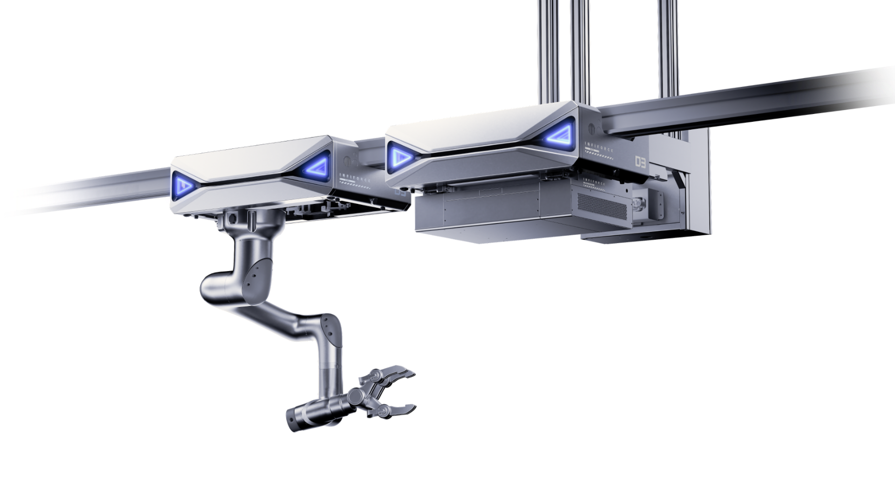

<section class="intro-card">
  
PhD Student · The University of Sydney

  <h1 class="intro-title">Building intelligent robots for the real world.</h1>
  

    I am currently a PhD student in Computer Science at <a href="https://www.sydney.edu.au/">The University of Sydney</a>, advised by <a href="https://www.weimingzhi.com/">Prof. Weiming (William) Zhi</a>. My research focuses on robot manipulation and embodied intelligence, enabling robots to perceive, reason, and act in complex real-world environments.
  

  

    I explore Vision-Language-Action (VLA) models, multimodal learning, imitation learning, and reinforcement learning to develop generalizable robot policies. My background spans mechanical design, control, planning, and AI, including research at ETH Zurich's <a href="https://crl.ethz.ch/index.html">Computational Robotics Lab</a> with <a href="https://yijiangh.github.io/">Dr. Yijiang Huang</a>.
  

  

    Robot Manipulation
    Embodied Intelligence
    Vision-Language-Action
  

</section>

# Research Interests

  <article class="interest-card">
    🤖
    <h3>Robot Manipulation</h3>
    
Dexterous and mobile manipulation, long-horizon tasks, and task-and-motion planning.

  </article>
  <article class="interest-card">
    🧠
    <h3>Embodied Intelligence</h3>
    
Visuomotor policy learning, imitation and reinforcement learning, generalization, and adaptation.

  </article>
  <article class="interest-card">
    🌐
    <h3>Vision-Language-Action</h3>
    
Multimodal representation learning, language-conditioned control, and foundation models for robotics.

  </article>

# Education

  <article class="timeline-item">
    Jul. 2026 – Present
    <h3>PhD in Computer Science</h3>
    
<a href="https://www.sydney.edu.au/engineering/schools/school-of-computer-science.html">School of Computer Science</a>, <a href="https://www.sydney.edu.au/">The University of Sydney</a>

    
Advisor: <a href="https://www.weimingzhi.com/">Prof. Weiming (William) Zhi</a>

  </article>
  <article class="timeline-item">
    Completed
    <h3>Master's Degree in Control Science and Engineering</h3>
    
<a href="http://www.cse.zju.edu.cn/cseenglish/main.htm">College of Control Science and Engineering</a>, <a href="https://www.zju.edu.cn/english/">Zhejiang University</a>

    
Advisor: Prof. Qinyuan Ren · Thesis: <em>Multi-modal Perception and Control Strategy for Unlocking Tasks Utilizing Manipulators</em>

  </article>
  <article class="timeline-item">
    Bachelor's
    <h3>Mechatronics Engineering &amp; Automation (Control)</h3>
    
Chu Kochen Honors Program, <a href="http://me.zju.edu.cn/meenglish/main.psp">School of Mechanical Engineering</a>, <a href="https://www.zju.edu.cn/english/">Zhejiang University</a>

  </article>

# Research Experience

  <article class="experience-card">
    

    

      Nov. 2025 – Present
      <h3>Zeno AI</h3>
      
Embodied AI Researcher

      
Whole-body teleoperation and embodied AI.

    

  </article>

  <article class="experience-card">
    

    

      Jun. 2024 – Feb. 2026
      <h3><a href="https://crl.ethz.ch/index.html">Computational Robotics Lab</a></h3>
      
Research Intern · ETH Zurich

      
Task-and-motion planning strategies for autonomous scaffolding assembly using mobile manipulators.

      
Mentor: <a href="https://yijiangh.github.io/">Dr. Yijiang Huang</a>

    

  </article>

  <article class="experience-card">
    

    

      Mar. 2021 – May 2022
      <h3><a href="https://github.com/ZJU-Biorobotics">ZJU-Biorobotics</a></h3>
      
Undergraduate Research Intern · Zhejiang University

      
Mechanical design and locomotion control of bio-inspired snake-like robots.

      
Advisor: <a href="https://person.zju.edu.cn/en/0008668">Prof. Qinyuan Ren</a>

    

  </article>

  <article class="experience-card">
    

    

      Sep. 2020 – Aug. 2021
      <h3><a href="https://www.robomaster.com/en-US">RoboMaster</a></h3>
      
Developer · DJI

      
Electrical design and embedded algorithm development for engineering robots.

      
Mentor: <a href="https://ieeexplore.ieee.org/author/37089021960">Dr. Pujing Lin</a>

    

  </article>

  <article class="experience-card">
    

    

      Jul. 2020 – Aug. 2020
      <h3>Robotics &amp; Machine Intelligence Lab</h3>
      
Undergraduate Research Intern · Zhejiang University

      
Locomotion of legged robots.

      
Advisor: <a href="https://person.zju.edu.cn/en/0011353">Prof. Qiuguo Zhu</a> · Mentor: <a href="https://wang-zhicheng.github.io/">Dr. Zhicheng Wang</a>

    

  </article>

# Professional Experience

Selected industry-grade robotic products that I have led or helped develop.

  <article class="project-card">
    

    <h3>Mobile Logistics Robots</h3>
    
Electrical Engineer

    
Designed circuit boards, developed embedded software, and built Python backends for autonomous navigation and warehouse operations.

    

      
      
    

  </article>

  <article class="project-card">
    

    <h3>Surface Cleaning Robot</h3>
    
Control Algorithms Intern

    
Developed control algorithms for autonomous cleaning of glass curtain walls and photovoltaic surfaces.

    

      
    

  </article>

  <article class="project-card">
    

    <h3>FORCE-02 Charging Robot</h3>
    
Project Leader

    
Led development and control-algorithm design for automated vehicle charging and high-efficiency scheduling.

    

      
    

  </article>

# Publications

  <article class="publication-card">
    
2026Construction Robotics

    <h3>A robot-friendly scaffolding system with passive error correction using tapered screw connectors</h3>
    
Pok Yin Victor Leung, Yijiang Huang, Yen-Ting Liu, Jakob Genhart, <strong>Zihao Li</strong>, Caelan Garrett, Stelian Coros

    <a class="publication-link" href="https://doi.org/10.1007/s41693-026-00191-3">DOI ↗</a>
  </article>

  <article class="publication-card">
    
2026arXiv

    <h3>Robots that Collaborate: Sequential Asymmetric Imitation for Learning Coupled Robot Policies</h3>
    
Yincong Chen, Ranpeng Qiu, <strong>Zihao Li</strong>, Yanan Zhou, Guoqiang Ren, Weiming Zhi

    <a class="publication-link" href="https://arxiv.org/abs/2606.16490">arXiv ↗</a>
  </article>

  <article class="publication-card">
    
2026arXiv

    <h3>TRACE: Trajectory-Routed Causal Memory for Delayed-Evidence Visuomotor Imitation</h3>
    
<strong>Zihao Li</strong>, Ranpeng Qiu, Yincong Chen, Guoqiang Ren, Weiming Zhi

    <a class="publication-link" href="https://arxiv.org/abs/2606.14551">arXiv ↗</a>
  </article>

  <article class="publication-card">
    
2026arXiv

    <h3>TriPilot-FF: Coordinated Whole-Body Teleoperation with Force Feedback</h3>
    
<strong>Zihao Li</strong>, Yanan Zhou, Ranpeng Qiu, Hangyu Wu, Guoqiang Ren, Weiming Zhi

    <a class="publication-link" href="https://arxiv.org/abs/2602.09888">arXiv ↗</a>
  </article>

  <article class="publication-card">
    
2025arXiv

    <h3>TAPOM: Task-Space Topology-Guided Motion Planning for Manipulating Elongated Object in Cluttered Environments</h3>
    
<strong>Zihao Li</strong>, Yiming Zhu, Zhe Zhong, Qinyuan Ren, Yijiang Huang

    <a class="publication-link" href="https://arxiv.org/abs/2511.05052">arXiv ↗</a>
  </article>

  <article class="publication-card">
    
2025ICCA

    <h3>Vision-Force Guided Robotic EV Charging: Learning-Based Localization and 6-DoF Hybrid Compliance Control for High-Precision Insertion</h3>
    
<strong>Zihao Li</strong>, Siqi Wang, Xiaocong Li, Yiming Zhu, Zhe Zhong, Yilin Lang, Qinyuan Ren

  </article>

  <article class="publication-card">
    
2024IEEE TIE

    <h3>A Motion Control Approach for Physical Human–Robot-Environment Interaction via Operational Behaviors Inference</h3>
    
Yilin Lang, <strong>Zihao Li</strong>, Zhaoyang Li, Yanan Li, Qinyuan Ren

  </article>

  <article class="publication-card">
    
2024ICML

    <h3>Meta-reinforcement Learning Robust to Distributional Shift via Performing Lifelong In-context Learning</h3>
    
Tengye Xu, <strong>Zihao Li</strong>, Zihao Li, Qinyuan Ren

  </article>

  <article class="publication-card">
    
2022ICIEA

    <h3>A Head Stabilizer of a Snake Robot Crawling in Serpentine Locomotion</h3>
    
<strong>Zihao Li</strong>, Jiangpeng Hu, Qinyuan Ren

  </article>

Explore the complete and latest publication record on <a href="https://scholar.google.com/citations?user=KNMrDtcAAAAJ">Google Scholar ↗</a>

# Honors &amp; Awards

<ul class="award-grid">
  <li><strong>2nd Place</strong>International Design Contest (IDC RoboCon), 2022</li>
  <li><strong>Arawana Scholarship</strong>Yihai Kerry Arawana Holdings, 2022</li>
  <li><strong>First Prize</strong>China University Robot Competition (RoboMaster), 2021</li>
  <li><strong>Hong Huang and Xiaobei Wu Scholarship</strong>2021</li>
  <li><strong>First Prize</strong>Chinese Mathematics Competition, Zhejiang, 2020</li>
  <li><strong>First Prize</strong>Zhejiang Physics Innovation Competition, 2020</li>
  <li><strong>Zhejiang Provincial Government Scholarship</strong>2020</li>
  <li><strong>Zhejiang University Scholarship</strong>Second Prize, 2020</li>
  <li><strong>Academic Excellence Award</strong>Zhejiang University, 2019–2020</li>
  <li><strong>Artistic and Athletic Achievement Award</strong>Zhejiang University, 2019–2020</li>
</ul>

# Beyond Research

  🏀 Basketball
  🏸 Badminton
  🏊 Swimming
  🎮 Hollow Knight
  🎮 God of War

